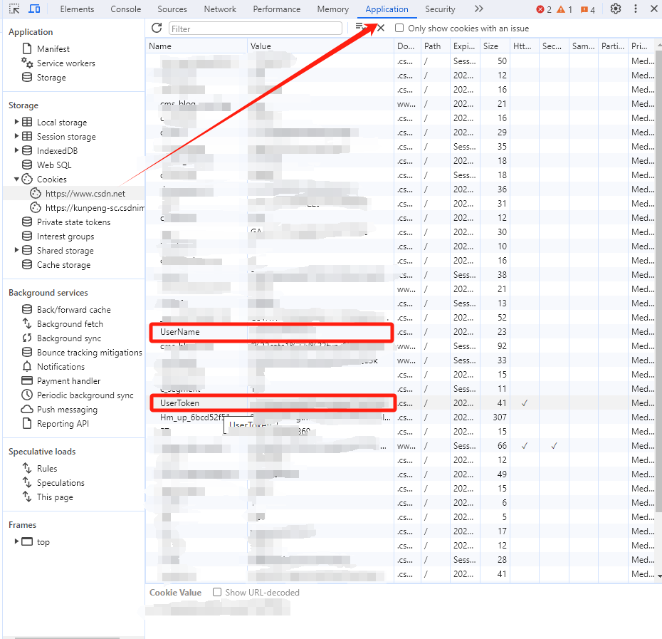

# BEAN-SDK-GO
豆小匠的go sdk，关注公众号【豆小匠Coding】了解更多

## CSDN 接口使用
### 1. 获取CSDN的user name和user token
打开csdn，打开控制台 - Application - Cookies，找到domain为blog.csdn.net的cookie，复制user_name和user_token的值

### 2. 调用接口
```go
go get github.com/anjude/bean-sdk-go
```
```go
package main

import (
	"github.com/anjude/bean-sdk-go/beansdk"
	"github.com/anjude/bean-sdk-go/services/csdn_service"
	"log"
)

func main() {
	client := beansdk.NewClient("", "")

	csdnService := csdn_service.NewCsdnService(client, "xxx", "xxx")
	resp, err := csdnService.HotArticleComment()
	if err != nil {
		panic(err)
	}
	log.Printf("done: %v", resp)
}
```
### 3. 效果
打开csdn https://mp.csdn.net/mp_blog/manage/comment - 我发表的评论

注：本代码仅用于学习目的，请不要滥用，否则后果自负